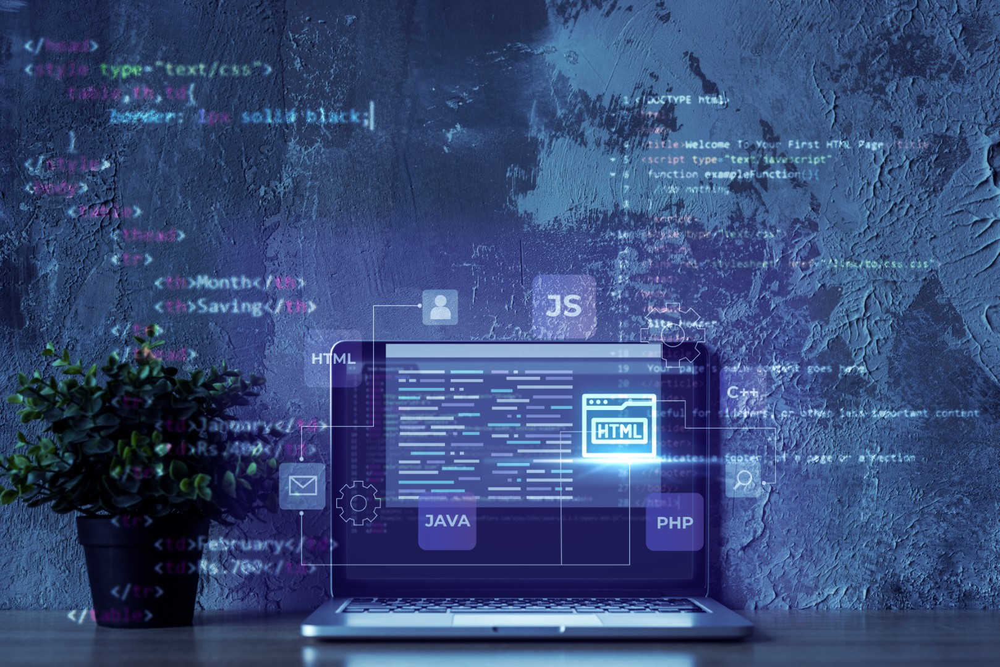

<h1 align="center">Hello,😊 I'm Deenathayalan</h1>

  
  

  

## 👨🏻‍💻 About Me:
  

- 🙋‍♂️ All about me is at **[My Website](https://thayalan.netlify.app)**

- 🔭 I’m currently working on `Something Intresting`.

- 🌱 I’m currently learning `MERN Stack`

- 👯 I’m looking to collaborate for `Dev Projects`

- 🤔 I’m looking for help with `Competitive Programming`

  
  
Hi there! Welcome to my GitHub profile! I'm Deenathayalan, a passionate MERN Stack Developer with a love for building web applications that are not only aesthetically pleasing but also highly functional and user-friendly.
  
  

 
`💻 My Journey:`
- My journey as a developer began with an insatiable curiosity for technology. I immersed myself in the world of programming, and my passion for creating impactful digital solutions led me to specialize in the MERN (MongoDB, Express.js, React.js, Node.js) stack. It's a powerful combination that allows me to craft full-stack applications from the ground up.

`🚀 Technical Expertise:`
- With several years of experience under my belt, I have honed my skills in front-end and back-end technologies. From designing elegant user interfaces with React.js to crafting robust and scalable server-side applications using Node.js and Express.js, I thrive in architecting seamless experiences for users.

 
`🗃️ Database Ninja:`
- As a MongoDB enthusiast, I take pride in mastering the art of NoSQL databases. From database design to handling complex queries, I'm skilled at optimizing data structures for improved performance and efficiency.

 
`🛠️ Problem Solver:`
- I believe that every line of code I write should contribute to solving real-world problems. I'm always up for a challenge and take pleasure in finding creative and innovative solutions to technical hurdles.

 
`💡 Continuous Learner:`
- In the ever-evolving world of technology, I understand the importance of staying up-to-date with the latest trends and best practices. I enjoy learning new tools, frameworks, and methodologies to continuously improve my craft.

 
`🤝 Collaborator:`
- Collaboration is at the core of successful projects, and I thrive in team environments. I communicate effectively, embrace feedback, and believe that diverse perspectives lead to better outcomes.

 
`📈 What's Next:`
- I'm always on the lookout for exciting opportunities that allow me to grow both personally and professionally. Whether it's contributing my expertise to an ambitious project or joining a dynamic team that shares my passion for innovation, I'm open to new adventures!

 
`📬 Let's Connect:`
- I'm thrilled to connect with like-minded individuals, fellow developers, potential collaborators, and anyone interested in discussing technology, programming, or just sharing ideas. Feel free to reach out, and let's embark on this journey together!

Looking forward to connecting with you! 😊

  

## 🛠️ Technologies and Tools I use:
  

 

 
 

<!-- ## ❤️ Let's get connected:

    

 -->
